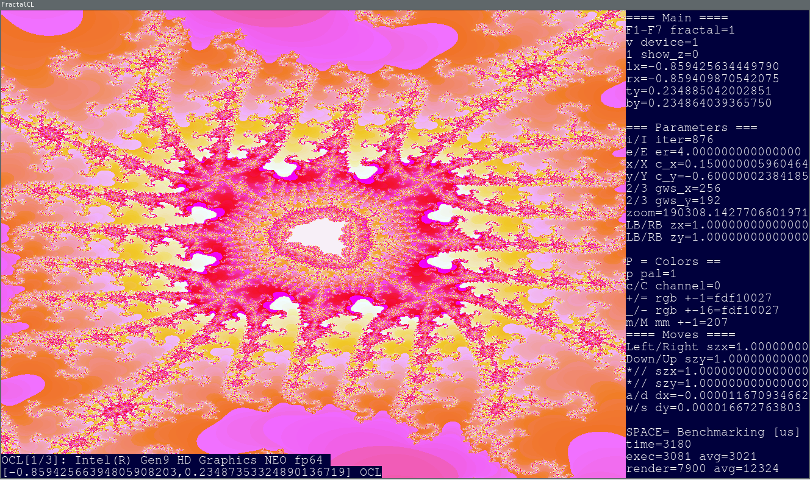
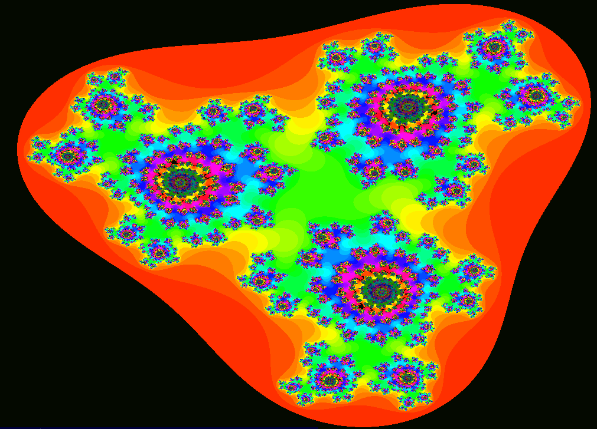
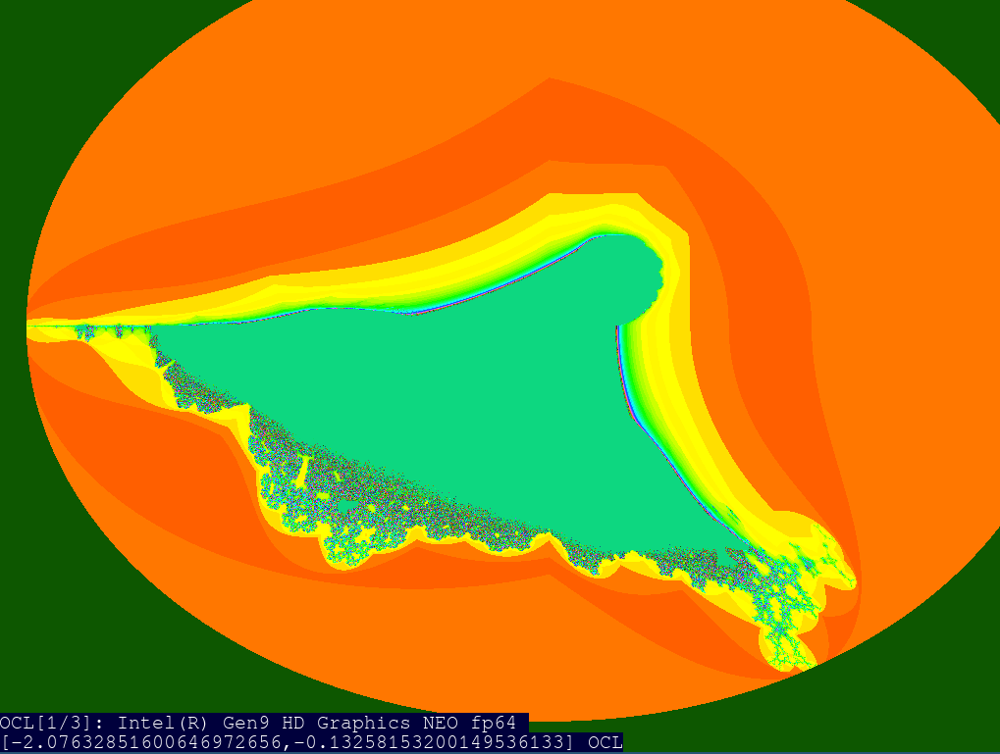
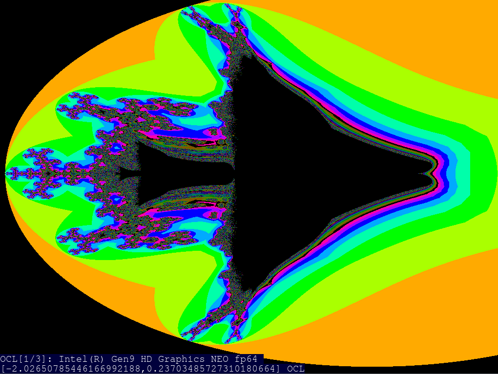
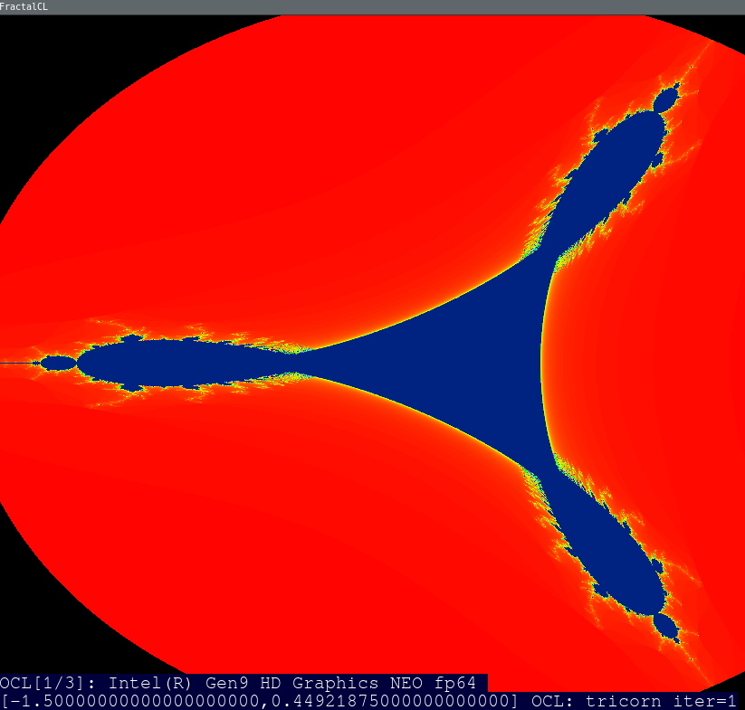

# FractalCL

Discover and explore fractals world with OpenCL acceleration.



# Features

* Interactive animated fractals
* Mouse support to zoom in/out
* Zoom limit set to 43000000000000 for fp64 and 300000 for fp32
* Keyboard support for changing fractals/kernel parameters
* OpenCL support to speed up fractals calculations
* 2 colors models: RGB and HSV
* OpenCL kernels can be executed on CPU without OpenCL libraries
* fp64 support checked at runtime, can be disabled in configuration (configure script)
* Support multiple OpenCL platforms/devices
* Performance tests

# Tested Linux OpenCL implementations

* Neo - Intel Graphics Compute Runtime for OpenCL: https://github.com/intel/compute-runtime
* Beignet - OpenCL Library for Intel GPU's: https://cgit.freedesktop.org/beignet
* OpenCL CPU - OpenCL Runtime for Intel Core and Intel Xeon Processors: https://software.intel.com/en-us/articles/opencl-drivers#latest_CPU_runtime
* Nvidia OpenCL 1.2 CUDA - The NVIDIA Accelerated Graphics Driver Set for Linux-x86_64: http://www.nvidia.com
* Portable Computing Language: http://pocl.sourceforge.net

# Mouse usage

* left button - increase zoom
* right button - decrease zoom
* middle button - stop animations

# Keyboard usage

* ESC - exit application
* r - set default parameters
* i/I - increase/decrease number of calculation's iteriations
* c/C/+/=/-/\_/m/M/h/H/j/J/k/K/l/L - change colors
* P - show color palettes
* LEFT/RIGTH - scale horizontally by 0.01
* UP/DOWN - scale vertically
* a/d - shift left/right
* s/w - shift down/up
* e/E - decrease/increase limit for compared modulus
* \*/\/ - scale horizontally and vertically
* p - change color pallette: RGB/HSV
* x/X - decrease/increase c (real part) of complex number (z^2 + c, z^3 + c)
* y/Y - decrease/increase c (imaginary part) of complex number (z^2 + c, z^3 + c)
* F1 - select Julia fractal
* F2 - select Mandelbrot fractal
* F3 - select Julia with gws aligned with window size
* F4 - select dragon fractal
* F5 - select Julia
* F6 - select burning ship
* F7 - select generalized celtic
* F8 - select tricorn
* v - change device used for calculation:
      0 = CPU
      1,..., n = OpenCL device

# Implemented fractals

* julia
```
j_x = z_x * z_x - z_y * z_y + c_x;
j_y = 2 * z_x * z_y + c_y;
```


* julia
```
j_x = z_x * z_x * z_x - 3 * z_x * z_y * z_y + c_x;
j_y = 3 * z_x * z_x * z_y - z_y * z_y * z_y + c_y;
```


* mandelbrot
```
j_x = z_x * z_x - z_y * z_y + c_x;
j_y = 2 * z_x * z_y + c_y;
```


* burning ship
```
j_x = z_x * z_x - z_y * z_y + c_x;
j_y = 2 * fabs(z_x * z_y) + c_y;
```


* generalized celtic
```
j_x = fabs(z_x * z_x - z_y * z_y) + c_x;
j_y = 2 * z_x * z_y + c_y;
```


* tricorn
```
j_x = z_x * z_x - z_y * z_y + c_x;
j_y = -2 * z_x * z_y + c_y;
```


* dragon
```
random select next point
x1 = -0.3 * xc - 1.0;
y1 = -0.3 * yc + 0.1;
or 
x1 = 0.76 * xc - 0.4 * yc;
y1 = 0.4 * xc + 0.76 * yc;

```


# Dependencies

* SDL2, SDL2_TTF, SDL2_GFX libraries
* OpenCL library (optional)

# Build and install instruction

* Run 'configure' script to configure project
* Run 'make' to build project
* Run 'make install' to install application

# Build configuration (configure script)

* FP_64_SUPPORT - Use fp64 extension [ON/OFF] (default ON)
* SDL_ACCELERATED - "Use SDL with GPU acceleration [ON/OFF] (default OFF)
* OPENCL_SUPPORT - Use OpenCL acceleration [ON/OFF] (default ON)
* PREFIX - directory where program will be installed

# Run instruction

* Execute 'FractalCL' application. Use mouse and keyboard to change fractals parameters.
* Use keys shown on right panel.
* Press ESC key to exit application.
* Application can be executed with few command line parameters
```
FractalCL -h
-dn - select n OpenCL device
-c  - run performance test on CPU
-l  - list OpenCL devices
-a  - test all OpenCL devices
-t  - run performance test
-i  - number of iterations in performance test
-q  - quiet mode - disable logs
-h  - show help
-v  - show version
-fn - select n fractal type
where n:
      0 - julia
      1 - mandelbrot
      2 - julia (full)
      3 - dragon
      4 - julia 3
      5 - burning ship
      6 - generalized celtic
```

# Tests (directory tests)

* test_ocl - verify OpenCL support
* test_complex - simple tests with complex numbers
* test_sdl - SDL2 benchmarking test

# Old interface v0.0.1


# Keyboard usage (old interface v0.0.1)

* ESC - exit application
* i/u - increase/decrease number of calculation's iteriations
* o/p/k/l/n/m - change colors
* g - show color palettes
* LEFT/RIGTH - scale horizontally by 0.01
* UP/DOWN - scale vertically
* a/d - shift left/right
* s/w - shift down/up
* z/x - decrease/increase limit for compared modulus
* comma/period - scale horizontally and vertically
* h - change color pallette: RGB/HSV
* [/] - decrease/increase c (real part) of complex number (z^2 + c, z^3 + c)
* -/= - decrease/increase c (imaginary part) of complex number (z^2 + c, z^3 + c)
* F1 - select Julia fractal
* F2 - select Mandelbrot fractal
* F3 - select Julia with gws aligned with window size
* F4 - select dragon fractal
* F5 - select Julia
* F6 - select burning ship
* F7 - select generalized celtic
* v - change device used for calculation:
      0 = CPU
      1,..., n = OpenCL device
* 1 - show calculated complex number
* 2 - multiply gws (global workgroup size) by 2
* 3 - divide gws (global workgroup size) by 2

